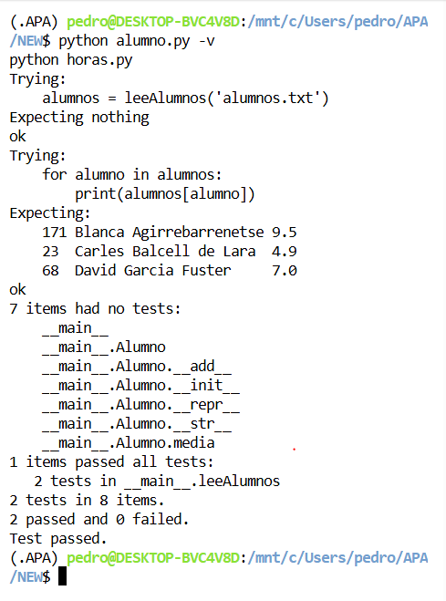

# Expresiones Regulares

## Nombre y Apellidos

Pedro Muñoz Álvarez

## Tratamiento de ficheros de notas

Se ha añadido al fichero `alumno.py` la función `leeAlumnos(ficAlum)`, que lee un
fichero de texto con los datos de los alumnos y devuelve un diccionario cuya clave
es el nombre de cada alumno y cuyo valor es el objeto `Alumno` correspondiente. El
análisis de cada línea se realiza mediante expresiones regulares y la función
incluye en su cadena de documentación la prueba unitaria exigida en el enunciado.

## Análisis de expresiones horarias

Se ha escrito el fichero `horas.py` con la función `normalizaHoras(ficText, ficNorm)`,
que lee el fichero `ficText`, localiza las expresiones horarias mediante expresiones
regulares y escribe el fichero `ficNorm` con dichas expresiones reescritas en el
formato normalizado `HH:MM`. Se contemplan los formatos `HH:MM`, `XhYm`, las
expresiones habladas (`en punto`, `y cuarto`, `y media`, `menos cuarto`) y los
modificadores `de la mañana`, `del mediodía`, `de la tarde`, `de la noche` y
`de la madrugada`. Las expresiones incorrectas se dejan sin modificar.

## Ejecución de los tests unitarios de alumno.py

A continuación se muestra el resultado de ejecutar los tests unitarios de
`alumno.py` con la opción verbosa (`python alumno.py -v`):



Ejecución de la normalización de expresiones horarias (`python horas.py`):


## Código desarrollado

### `alumno.py`

```python
"""
Tratamiento de ficheros de notas de alumnos mediante expresiones regulares.

Este módulo define la clase 'Alumno', que almacena el número de identificación,
el nombre y la lista de notas de cada alumno, y la función 'leeAlumnos', que lee
un fichero de texto con los datos de varios alumnos y devuelve un diccionario
indexado por el nombre de cada uno.

Autor: Pedro Muñoz Álvarez
"""

import re
import doctest


class Alumno:
    """
    Clase usada para el tratamiento de las notas de los alumnos. Cada uno
    incluye los atributos siguientes:

    numIden:   Número de identificación. Es un número entero que, en caso
               de no indicarse, toma el valor por defecto 'numIden=-1'.
    nombre:    Nombre completo del alumno.
    notas:     Lista de números reales con las distintas notas de cada alumno.
    """

    def __init__(self, nombre, numIden=-1, notas=[]):
        self.numIden = numIden
        self.nombre = nombre
        self.notas = [nota for nota in notas]

    def __add__(self, other):
        """
        Devuelve un nuevo objeto 'Alumno' con una lista de notas ampliada con
        el valor pasado como argumento. De este modo, añadir una nota a un
        Alumno se realiza con la orden 'alumno += nota'.
        """
        return Alumno(self.nombre, self.numIden, self.notas + [other])

    def media(self):
        """
        Devuelve la nota media del alumno.
        """
        return sum(self.notas) / len(self.notas) if self.notas else 0

    def __repr__(self):
        """
        Devuelve la representación 'oficial' del alumno. A partir de copia
        y pega de la cadena obtenida es posible crear un nuevo Alumno idéntico.
        """
        return f'Alumno("{self.nombre}", {self.numIden!r}, {self.notas!r})'

    def __str__(self):
        """
        Devuelve la representación 'bonita' del alumno. Visualiza en tres
        columnas separas por tabulador el número de identificación, el nombre
        completo y la nota media del alumno con un decimal.
        """
        return f'{self.numIden}\t{self.nombre}\t{self.media():.1f}'


def leeAlumnos(ficAlum):
    """
    Lee un fichero de texto con los datos de todos los alumnos y devuelve un
    diccionario en el que la clave es el nombre de cada alumno y su contenido
    el objeto Alumno correspondiente.

    >>> alumnos = leeAlumnos('alumnos.txt')
    >>> for alumno in alumnos:
    ...     print(alumnos[alumno])
    ...
    171	Blanca Agirrebarrenetse	9.5
    23	Carles Balcell de Lara	4.9
    68	David Garcia Fuster	7.0
    """
    patron = re.compile(r'^\s*(\d+)\s+([A-Za-zÀ-ÿ\s]+?)\s+([\d\.\s]+)$')
    diccionario_alumnos = {}

    with open(ficAlum, 'r', encoding='utf-8') as fichero:
        for linea in fichero:
            linea = linea.strip()
            if not linea:
                continue

            match = patron.match(linea)
            if match:
                numIden = int(match.group(1))
                nombre = match.group(2).strip()

                notas_str = match.group(3).split()
                notas = [float(nota) for nota in notas_str]

                diccionario_alumnos[nombre] = Alumno(nombre, numIden, notas)

    return diccionario_alumnos


if __name__ == "__main__":
    doctest.testmod(optionflags=doctest.NORMALIZE_WHITESPACE)
```

### `horas.py`

```python
"""
Análisis y normalización de expresiones horarias mediante expresiones regulares.

Este módulo proporciona la función 'normalizaHoras', que lee un fichero de texto,
busca en él las expresiones horarias escritas en lenguaje natural (castellano) y
genera un nuevo fichero en el que dichas expresiones se reescriben en el formato
estándar HH:MM. Las expresiones incorrectas se dejan sin modificar.

Autor: Pedro Muñoz Álvarez
"""

import re


def procesar_coincidencia(match):
    """
    Función auxiliar que decide si una coincidencia de la expresión regular
    es una hora válida y, si lo es, la transforma al formato HH:MM. Si la
    expresión es incorrecta, devuelve el texto original sin modificar.
    """
    texto_original = match.group(0)

    # La hora puede haber encajado en cualquiera de las cuatro alternativas
    h_str = (match.group('h1') or match.group('h2')
             or match.group('h3') or match.group('h4'))
    if not h_str:
        return texto_original

    hora = int(h_str)
    hora_original = hora
    minutos = 0

    # 1. Formato con dos puntos (18:30): los minutos deben tener dos dígitos
    if match.group('minutos'):
        minutos = int(match.group('minutos'))
        if minutos > 59 or hora > 23:
            return texto_original

    # 2. Formato con 'h' (8h27m, 17h5m, 8h): los minutos admiten uno o dos dígitos
    elif match.group('minutos_h'):
        minutos = int(match.group('minutos_h'))
        if minutos > 59 or hora > 23:
            return texto_original

    # 3. Formato hablado con partícula (en punto, y cuarto, y media, menos cuarto)
    elif match.group('texto_min'):
        texto_min = match.group('texto_min').lower()
        if 'y cuarto' in texto_min:
            minutos = 15
        elif 'y media' in texto_min:
            minutos = 30
        elif 'menos cuarto' in texto_min:
            minutos = 45
            hora -= 1
        elif 'en punto' in texto_min:
            minutos = 0

        # En lenguaje hablado la hora base debe estar entre 1 y 12
        if not (1 <= hora_original <= 12):
            return texto_original

        # Ajuste al restar (1 menos cuarto -> 12:45, que luego pasa a 00:45)
        if hora == 0:
            hora = 12

    modificador = match.group('mod')

    # 4. Validación y ajuste según el modificador (de la mañana, tarde, etc.)
    if modificador:
        modificador = modificador.lower()

        # Con modificador el reloj siempre es de 1 a 12
        if not (1 <= hora_original <= 12):
            return texto_original

        if 'mañana' in modificador:
            if not (4 <= hora_original <= 12):
                return texto_original
            if hora == 12:
                hora = 0
        elif 'mediodía' in modificador:
            if not (1 <= hora_original <= 3 or hora_original == 12):
                return texto_original
            if hora != 12:
                hora += 12
        elif 'tarde' in modificador:
            if not (3 <= hora_original <= 8):
                return texto_original
            if hora != 12:
                hora += 12
        elif 'noche' in modificador:
            if not (8 <= hora_original <= 12 or 1 <= hora_original <= 4):
                return texto_original
            if hora == 12:
                hora = 0
            elif hora < 12:
                hora += 12
        elif 'madrugada' in modificador:
            if not (1 <= hora_original <= 6):
                return texto_original
    else:
        # Formato hablado sin modificador (8 en punto): rango 00:00 a 11:59
        if match.group('texto_min'):
            if hora == 12:
                hora = 0

    return f"{hora:02d}:{minutos:02d}"


def normalizaHoras(ficText, ficNorm):
    """
    Lee el fichero de texto 'ficText', busca en él las expresiones horarias
    mediante expresiones regulares y escribe el fichero 'ficNorm' con dichas
    expresiones reescritas en el formato normalizado HH:MM. Las expresiones
    incorrectas se mantienen tal cual.
    """
    patron = re.compile(
        r'\b(?:'
        r'(?P<h1>\d{1,2}):(?P<minutos>\d{2})\b|'
        r'(?P<h2>\d{1,2})h(?P<minutos_h>\d{1,2})?m?\b|'
        r'(?P<h3>\d{1,2})\s+(?P<texto_min>en punto|y cuarto|y media|menos cuarto)\b|'
        r'(?P<h4>\d{1,2})(?=\s+(?:de la mañana|del mediodía|de la tarde|de la noche|de la madrugada))'
        r')'
        r'(?:\s+(?P<mod>de la mañana|del mediodía|de la tarde|de la noche|de la madrugada))?',
        re.IGNORECASE
    )

    with open(ficText, 'r', encoding='utf-8') as f_in, \
         open(ficNorm, 'w', encoding='utf-8') as f_out:
        for linea in f_in:
            linea_mod = patron.sub(procesar_coincidencia, linea)
            f_out.write(linea_mod)


if __name__ == "__main__":
    normalizaHoras('horas.txt', 'horas_normalizadas.txt')
```
